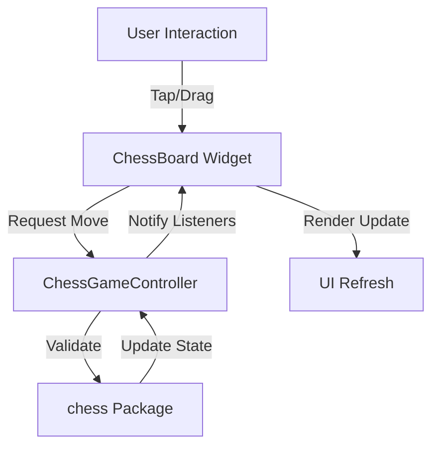
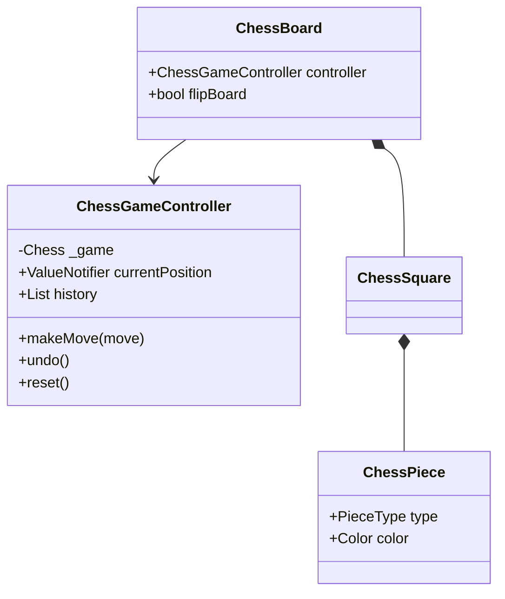

# Design Document: Chess Core Game

## Overview
`chess_core_game` is a full-featured Flutter-based chess application. It provides a complete chess playing experience, including move validation, game state management (FEN/PGN), and a modern, responsive user interface following Material Design 3 principles.

## Detailed Analysis
The goal is to create a robust chess game that is both functional and visually appealing. Chess involves complex rules (castling, en passant, promotion, check/mate detection) and requires precise state management.

### Key Requirements
- Full chess rule enforcement.
- Support for FEN (Forsyth-Edwards Notation) for loading/saving positions.
- Support for PGN (Portable Game Notation) for move history.
- Responsive chessboard UI that works on mobile and web.
- Interactive elements: drag-and-drop or tap-to-move.
- Visual feedback: move highlights, check indicators, and capture animations.

## Alternatives Considered
1. **Custom Chess Logic vs. `chess` package:**
   - *Custom Logic:* Writing chess rules from scratch is error-prone and time-consuming.
   - *Existing Package:* Using the `chess` package (a Dart port of `chess.js`) provides a well-tested foundation for move generation and validation.
   - **Decision:** Use the `chess` package for the core logic.

2. **`flutter_chess_board` vs. Custom UI:**
   - *`flutter_chess_board`:* Quick to implement but harder to customize for specific Material 3 aesthetics and unique features.
   - *Custom UI:* Building the board from scratch using `GridView` and `CustomPainter` or standard widgets allows for complete control over styling, animations, and responsiveness.
   - **Decision:** Build a custom UI for maximum flexibility and to showcase premium design (e.g., subtle textures, deep shadows).

3. **State Management:**
   - *Provider/BLoC:* Good for large apps but might be overkill for a single-package game.
   - *ChangeNotifier/ValueNotifier:* Flutter-native and perfectly suited for game states like `ChessBoardController`.
   - **Decision:** Use `ChangeNotifier` for the game controller and `ValueNotifier` for transient UI states.

## Detailed Design

### Core Logic Layer
The game state will be managed by a `ChessGameController` which wraps the `chess.Chess` object. This controller will handle:
- Applying moves (SAN or Coordinate).
- Validating legal moves for a selected piece.
- Tracking game status (Check, Mate, Draw).
- Exporting/Importing FEN and PGN.

### Presentation Layer
- **`ChessBoard` Widget:** A responsive grid (8x8) that renders squares and pieces.
- **`ChessSquare` Widget:** Represents an individual square, handling highlights and tap events.
- **`ChessPiece` Widget:** Renders the piece (using SVG or high-quality PNGs).
- **`MoveHistory` Widget:** Displays PGN history.
- **`GameControls` Widget:** Buttons for Reset, Undo, and Flip Board.

### Data Layer
- Models for `Position`, `Move`, and `GameResult`.
- FEN and PGN parsing utilities.

## Diagrams

## Summary
The design leverages the `chess` package for reliable logic while providing a custom, high-quality Flutter UI. It follows a clean separation of concerns between the game engine and the presentation layer, ensuring maintainability and a premium user experience.

## References
- [chess package on pub.dev](https://pub.dev/packages/chess)
- [Material Design 3 Guidelines](https://m3.material.io/)
- [Effective Dart Documentation](https://dart.dev/effective-dart)
- [Flutter Layout Best Practices](https://docs.flutter.dev/ui/layout)
